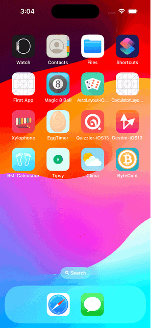

#  ByteCoin

## Goal

Fetch the Application Programming Interfaces (APIs) to grab live data about Bitcoin from the internet. This includes: dark-mode enabled, protocols/delegates, PickerView. You'll be able to check the bitcoin value for the selected currency. 

## What you will learn

* How to create a dark-mode enabled app. 
* Learn about the delegate pattern.
* Swift protocols. 
* Swift closures and completion handlers.
* Learn to use URLSession to network and make HTTP requests.
* Parse JSON with the native Encodable and Decodable protocols. 
* Learn to use Grand Central Dispatch to fetch the main thread.

>This app is build using resources provided by AppBrewery course on IOS
